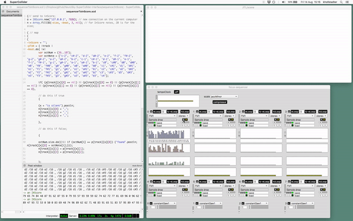

# neurosky-supercollider

A NeuroSky and SuperCollider interface. An audio neurogame.

The interface (neurogame) has two main parts:

- neurofeedback system
- sequencer (can be accessed separately as a GUI)

'eeg-devices/neurosky' folder contains documents and mac driver for NeuroSky.

_extra:_
1. sequencer can send messages to [<kbd>InScore</kbd>](http://inscore.sourceforge.net/) via [<kbd>R.Hoadley</kbd>](http://rhoadley.net/)'s SuperCollider class;

## log
* 0.2.2
  - added last version of InScore experiment; 
* 0.2.1
  - Fredik adds synths suggestions;
  - some minor changes (manual update): new mix in islets, changed reward tasks;
* 0.2
  - added new mapping to islet1;
  - user can change TTH as well on GUI;
* 0.1.9
  - fix for compressor synth (Fredrik)
* 0.1.8
  - NeuroSky docs and driver added to extra folders;
  - organise synths;
  - made arguments clearer in functions after .value (added UX)
  - panning Ugen parameters are slightly different in each constantSynth.  they are can be controlled by the eSenses.  one side of the Pan is the same, so when 2 synths are mapped to different eSenses (the higher a value the more in phase the sounds are, the lower, the less in phase)
  - victory sound on track 9 (each islet the same)
  - 3 islets (no sea), challenges are there, but they don't move (so no pressure, users can choose each islet manually)' '
  - synths removed;

* 0.1.7 (2020-07-09)
  - can choose which eSense controls constantSynth parameter.  can add 3rd synth that can be controlled by both (change0 and change 3) in ~fadeConstantSynts
  - manual threshold added (~rewCalcTask simplified)
  - new GUI;
  - automove disables;
  - enter straight into sea (new practice)
* 0.1.6 (2016-09-05)
* 0.1.3.7 (2016-06-05)

## TODO
- better vicory sound, perhaps different one for all islets
- why is slider posting?
- make videos (nf and sequencer)
- make reset load at the beginning of each island (~loadFile.value(track:{all},filename:0);)
- make each islet sound good (rewards, victor sound) - try to use as many reward types as possible;
- if max counter is above the current save max, than start counting: update GUI as well;
- TTH should restart when signal goes below TH (not when it goes above TH again)

## later:
- check scale arrays in generate.scd
- clean code;
- make new CMW videos;

## NOTE
- tracks start from 0, not 1 (need to be consistent when talking, naming, commenting, etc; )
